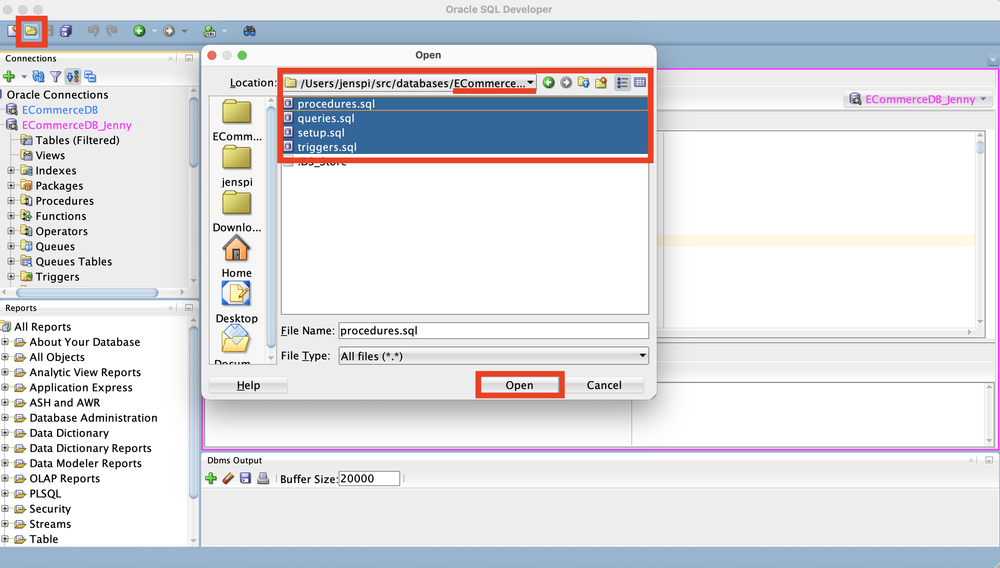
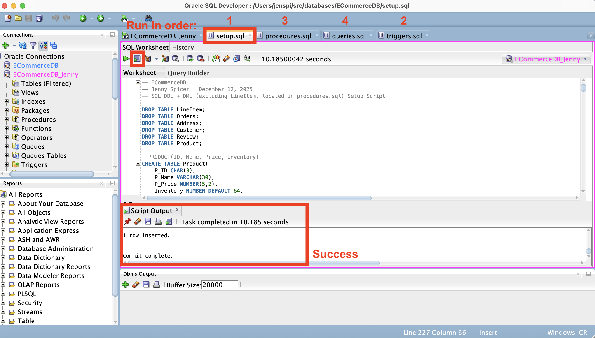

# 🧩 Connecting Oracle Autonomous Database to SQL Developer

This guide explains how to connect an **Oracle Autonomous Database (ATP / AI Database)** to **Oracle SQL Developer** using a cloud wallet.

> [!NOTE]
> ***This guide was made for Jenny but can be followed by other users.*** 

## 🔖 Prerequisites

- [Oracle Cloud Free Tier account](https://signup.cloud.oracle.com/?source=:ow:o:p:feb:0916FreePageBannerButton&intcmp=:ow:o:p:feb:0916FreePageBannerButton) *(You'll never be charged for any services unless you upgrade tiers. Note: info saved in DashLane)*
- Autonomous Database status = **Available**
- Oracle SQL Developer installed (v19+ recommended)

## 📁 Step 1: Download the Database Wallet

1. Log into **[Oracle Cloud Console](https://cloud.oracle.com/)** *(Note: info saved in DashLane)*
2. Navigate to **Oracle Database → Autonomous Database**
3. Click your database name
4. Select **DB Connection**
5. Click **Download Wallet**
6. Set a wallet password
7. Download the ZIP file — **do not unzip the file**

## 🪟 Step 2: Open SQL Developer

Launch **Oracle SQL Developer**.

## ➕ Step 3: Create a New Connection

1. Click **➕ New Connection**
2. Enter the following:

### Connection Details

- **Connection Name:** `Autonomous_ECommerceDB`
- **Username:** `ADMIN` (or your schema user later)
- **Password:** Your database password
- **Connection Type:** Select `Cloud Wallet`
- **Configuration File:** Click Browse → select the wallet ZIP file
- **Service:** Choose one ending in `_tp`  
  Example: `ecommercedb_tp`


## 🧪 Step 4: Test the connection

3. Click **Test**  
   ✅ Status should be: **Success**  
4. Click **Connect**  
   🎉 You’re connected.

## ‼️ Step 5: (IMPORTANT) Create Your Own Schema User

Do **NOT** do project work as `ADMIN`. Run this once:

```sql
CREATE USER jenny IDENTIFIED BY "Enter your strong password here!!!";
GRANT CONNECT, RESOURCE TO jenny;
ALTER USER jenny QUOTA UNLIMITED ON DATA;
```

## ➕➕ Step 6: Reconnect as Your User

Create a new connection in SQL Developer with the following details:

- **Username:** jenny  
- **Password:** the one you set  
- **Wallet:** use the same wallet as before  
- **Service:** use the same `_tp` service


## ⚙️ Step 7: Run Your SQL Files (Order Matters)

<p align="center"><p align="center">Open your files in SQL Developer</p></p>

**Open the DBMS output**: View > Dbms Output<br>

### Run the following SQL files from [../ECommerceDB/](../ECommerceDB/) in this order:
1. `setup.sql` → **Database Setup / Schema Creation**  
2. `triggers.sql` → **Database Triggers**  
3. `procedures.sql` → **Stored Procedures**  
4. `queries.sql` → **Predefined Queries / Retrieval Scripts**  
5. `views.sql` → **Views / Data Aggregation (for Power BI)**
<p align="center"><p align="center">....</p></p>

After running all of them, you should be able to execute:
```sql
SELECT * FROM v_product_sales;
```